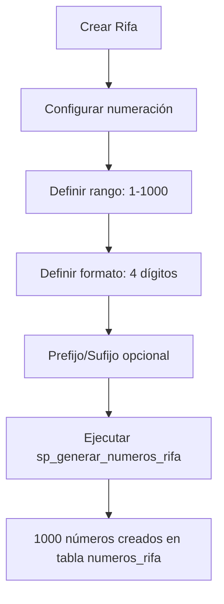
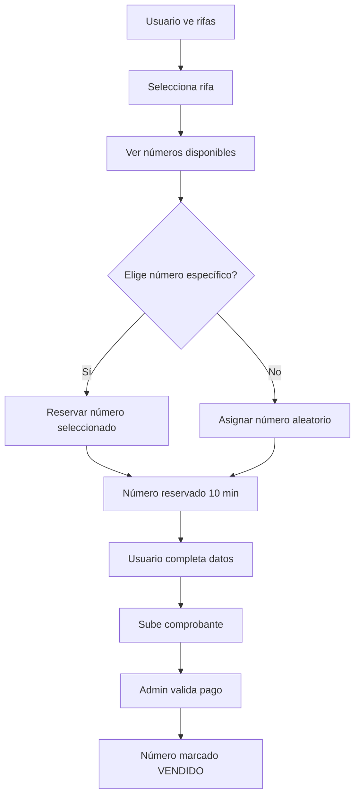
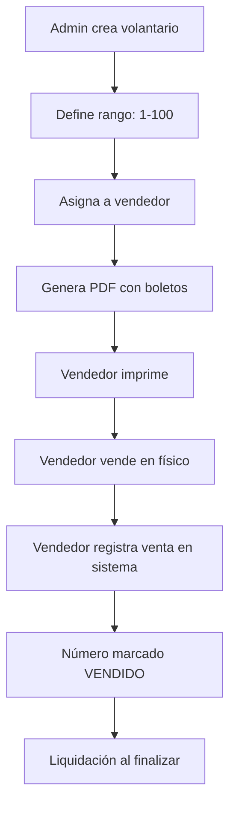

# Sistema de Numeración de Boletos y Volantarios

## 📋 Índice
1. [Introducción](#introducción)
2. [Características Principales](#características-principales)
3. [Estructura de Base de Datos](#estructura-de-base-de-datos)
4. [Flujos de Trabajo](#flujos-de-trabajo)
5. [Configuración de Rifas](#configuración-de-rifas)
6. [Proceso de Compra Online](#proceso-de-compra-online)
7. [Proceso de Venta Física](#proceso-de-venta-física)
8. [Gestión de Volantarios](#gestión-de-volantarios)
9. [Impresión de Boletos](#impresión-de-boletos)
10. [Procedimientos Almacenados](#procedimientos-almacenados)
11. [Ejemplos de Implementación](#ejemplos-de-implementación)

---

## Introducción

Este sistema permite gestionar rifas con **numeración específica de boletos**, soportando tanto venta online como física mediante volantarios impresos.

### ¿Qué resuelve?

✅ Permite que usuarios elijan números específicos
✅ Asigna números al azar a quienes no elijan
✅ Gestiona volantarios impresos para venta física
✅ Controla disponibilidad en tiempo real
✅ Evita venta duplicada de números
✅ Permite configurar formatos de numeración personalizados

---

## Características Principales

### 1. **Numeración Flexible**
- Rango configurable (ej: 1-5000, 100-9999)
- Formato personalizable con prefijos/sufijos
- Cantidad de dígitos ajustable
- Números especiales/bloqueados

### 2. **Doble Canal de Venta**
- **Online**: Compra desde la web con selección de número
- **Física**: Volantarios impresos para vendedores

### 3. **Sistema de Reservas**
- Reserva temporal durante proceso de compra
- Liberación automática de reservas expiradas
- Prevención de doble venta

### 4. **Gestión de Volantarios**
- Creación de bloques de números
- Asignación a vendedores
- Control de liquidación
- Seguimiento de ventas por volantario

---

## Estructura de Base de Datos

### 📊 Tabla: `rifas` (campos nuevos)

```sql
-- Control de números de boletos
usa_numeracion_boletos TINYINT(1) DEFAULT 1
tipo_numeracion VARCHAR(20) DEFAULT 'CORRELATIVO'
numero_inicial INT NOT NULL DEFAULT 1
numero_final INT NOT NULL DEFAULT 1000
cantidad_digitos INT DEFAULT 4
prefijo_numero VARCHAR(20) NULL
sufijo_numero VARCHAR(20) NULL

-- Configuración de selección
permitir_seleccion_numero TINYINT(1) DEFAULT 1
asignacion_automatica TINYINT(1) DEFAULT 1
mostrar_numeros_disponibles TINYINT(1) DEFAULT 1

-- Configuración de volantarios
generar_volantarios TINYINT(1) DEFAULT 0
numeros_por_volantario INT DEFAULT 100
formato_impresion VARCHAR(50) DEFAULT 'A4'
numeros_por_pagina INT DEFAULT 10
```

### 📊 Tabla: `tickets` (campos nuevos)

```sql
-- Número de boleto asignado
numero_boleto VARCHAR(50) NULL
numero_boleto_entero INT NULL
numero_seleccionado_usuario TINYINT(1) DEFAULT 0
volantario_id INT NULL

-- Canal de venta
canal_venta VARCHAR(20) DEFAULT 'WEB'
vendedor_id INT NULL
```

### 📊 Tabla: `numeros_rifa` (NUEVA)

Gestiona cada número de boleto individualmente:

| Campo | Descripción |
|-------|-------------|
| `numero_entero` | Número sin formato (ej: 523) |
| `numero_formateado` | Número con formato (ej: RIFA-0523) |
| `estado` | DISPONIBLE, RESERVADO, VENDIDO, BLOQUEADO |
| `ticket_id` | Referencia al ticket cuando se vende |
| `reservado_hasta` | Fecha límite de reserva temporal |
| `volantario_id` | Volantario al que pertenece |

### 📊 Tabla: `volantarios` (NUEVA)

Gestiona bloques de boletos para venta física:

| Campo | Descripción |
|-------|-------------|
| `codigo_volantario` | Código único (ej: VOL-001) |
| `numero_inicial` | Primer número del bloque |
| `numero_final` | Último número del bloque |
| `cantidad_numeros` | Total de números |
| `numeros_vendidos` | Contador de vendidos |
| `asignado_vendedor_id` | Vendedor responsable |
| `archivo_pdf` | PDF generado para impresión |

---

## Flujos de Trabajo

### 🔄 Flujo 1: Creación de Rifa con Numeración



**SQL:**
```sql
-- 1. Crear/Configurar Rifa
UPDATE rifas SET
    usa_numeracion_boletos = 1,
    numero_inicial = 1,
    numero_final = 1000,
    cantidad_digitos = 4,
    prefijo_numero = 'RIFA-',
    permitir_seleccion_numero = 1,
    asignacion_automatica = 1,
    mostrar_numeros_disponibles = 1
WHERE id = 1;

-- 2. Generar números
CALL sp_generar_numeros_rifa(1);
-- Resultado: Números 0001-1000 creados con formato "RIFA-0001", "RIFA-0002", etc.
```

### 🔄 Flujo 2: Compra Online con Selección de Número



**Código JavaScript (Frontend):**
```javascript
// Mostrar números disponibles
async function cargarNumerosDisponibles(rifaId) {
    const response = await fetch(`/api/rifas/${rifaId}/numeros-disponibles`);
    const numeros = await response.json();
    
    // Mostrar en grid
    numeros.forEach(num => {
        const btn = document.createElement('button');
        btn.className = 'btn btn-outline-primary numero-boleto';
        btn.textContent = num.numero_formateado;
        btn.dataset.numero = num.numero_entero;
        btn.onclick = () => seleccionarNumero(rifaId, num.numero_entero);
        document.getElementById('grid-numeros').appendChild(btn);
    });
}

// Reservar número seleccionado
async function seleccionarNumero(rifaId, numeroEntero) {
    const response = await fetch('/api/rifas/reservar-numero', {
        method: 'POST',
        headers: {'Content-Type': 'application/json'},
        body: JSON.stringify({
            rifa_id: rifaId,
            numero_entero: numeroEntero,
            sesion_id: sessionStorage.getItem('session_id')
        })
    });
    
    const result = await response.json();
    if (result.exito) {
        // Proceder con la compra
        document.getElementById('numero_reservado').value = numeroEntero;
        mostrarFormularioCompra();
    } else {
        alert(result.mensaje);
    }
}

// Solicitar número aleatorio
async function asignarNumeroAleatorio(rifaId) {
    const response = await fetch('/api/rifas/numero-aleatorio', {
        method: 'POST',
        headers: {'Content-Type': 'application/json'},
        body: JSON.stringify({
            rifa_id: rifaId,
            sesion_id: sessionStorage.getItem('session_id')
        })
    });
    
    const result = await response.json();
    if (result.exito) {
        alert(`Se te asignó el número: ${result.numero_formateado}`);
        document.getElementById('numero_reservado').value = result.numero_entero;
        mostrarFormularioCompra();
    }
}
```

**Código PHP (Backend):**
```php
<?php
// Endpoint: /api/rifas/reservar-numero
public function reservarNumero() {
    $data = json_decode(file_get_contents('php://input'), true);
    
    $stmt = $this->db->prepare("
        CALL sp_reservar_numero(?, ?, ?, 10, @exito, @mensaje)
    ");
    $stmt->execute([
        $data['rifa_id'],
        $data['numero_entero'],
        $data['sesion_id']
    ]);
    
    $result = $this->db->query("SELECT @exito as exito, @mensaje as mensaje")->fetch();
    
    echo json_encode($result);
}

// Endpoint: /api/rifas/numero-aleatorio
public function asignarNumeroAleatorio() {
    $data = json_decode(file_get_contents('php://input'), true);
    
    $stmt = $this->db->prepare("
        CALL sp_asignar_numero_aleatorio(?, ?, 10, @numero, @formateado, @exito, @mensaje)
    ");
    $stmt->execute([
        $data['rifa_id'],
        $data['sesion_id']
    ]);
    
    $result = $this->db->query("
        SELECT @numero as numero_entero, 
               @formateado as numero_formateado,
               @exito as exito, 
               @mensaje as mensaje
    ")->fetch();
    
    echo json_encode($result);
}

// Confirmar venta después de validar pago
public function confirmarVenta($ticketId, $rifaId, $numeroEntero) {
    // Actualizar ticket con el número
    $this->db->prepare("
        UPDATE tickets 
        SET numero_boleto_entero = ?,
            numero_boleto = (
                SELECT numero_formateado 
                FROM numeros_rifa 
                WHERE rifa_id = ? AND numero_entero = ?
            )
        WHERE id = ?
    ")->execute([$numeroEntero, $rifaId, $numeroEntero, $ticketId]);
    
    // Marcar número como vendido
    $stmt = $this->db->prepare("
        CALL sp_confirmar_venta_numero(?, ?, ?, @exito, @mensaje)
    ");
    $stmt->execute([$rifaId, $numeroEntero, $ticketId]);
    
    $result = $this->db->query("SELECT @exito as exito, @mensaje as mensaje")->fetch();
    return $result;
}
?>
```

### 🔄 Flujo 3: Venta Física con Volantarios



**Crear Volantario:**
```sql
-- Crear volantario para vendedor
CALL sp_crear_volantario(
    1,              -- sede_id
    1,              -- rifa_id
    'VOL-001',      -- codigo_volantario
    1,              -- numero_inicial
    100,            -- numero_final
    5,              -- vendedor_id
    @vol_id,        -- OUT volantario_id
    @exito,         -- OUT exito
    @mensaje        -- OUT mensaje
);

SELECT @vol_id, @exito, @mensaje;
```

---

## Configuración de Rifas

### Ejemplo 1: Rifa Simple (0001-0500)

```sql
UPDATE rifas SET
    usa_numeracion_boletos = 1,
    tipo_numeracion = 'CORRELATIVO',
    numero_inicial = 1,
    numero_final = 500,
    cantidad_digitos = 4,
    prefijo_numero = NULL,
    sufijo_numero = NULL,
    permitir_seleccion_numero = 1,
    asignacion_automatica = 1
WHERE id = 1;

CALL sp_generar_numeros_rifa(1);
-- Genera: 0001, 0002, 0003, ..., 0500
```

### Ejemplo 2: Rifa con Prefijo (RIFA-001 a RIFA-999)

```sql
UPDATE rifas SET
    usa_numeracion_boletos = 1,
    numero_inicial = 1,
    numero_final = 999,
    cantidad_digitos = 3,
    prefijo_numero = 'RIFA-',
    sufijo_numero = NULL
WHERE id = 2;

CALL sp_generar_numeros_rifa(2);
-- Genera: RIFA-001, RIFA-002, ..., RIFA-999
```

### Ejemplo 3: Rifa con Sufijo de Año

```sql
UPDATE rifas SET
    usa_numeracion_boletos = 1,
    numero_inicial = 1,
    numero_final = 1000,
    cantidad_digitos = 4,
    prefijo_numero = 'BOL',
    sufijo_numero = '-2025'
WHERE id = 3;

CALL sp_generar_numeros_rifa(3);
-- Genera: BOL0001-2025, BOL0002-2025, ..., BOL1000-2025
```

---

## Proceso de Compra Online

### Paso 1: Mostrar Números Disponibles

**HTML:**
```html
<div class="container">
    <h4>Selecciona tu número de la suerte</h4>
    <div id="grid-numeros" class="numeros-grid">
        <!-- Números se cargan dinámicamente -->
    </div>
    <button class="btn btn-primary" onclick="asignarNumeroAleatorio()">
        O déjanos elegir uno para ti
    </button>
</div>

<style>
.numeros-grid {
    display: grid;
    grid-template-columns: repeat(auto-fill, minmax(80px, 1fr));
    gap: 10px;
    padding: 20px;
}
.numero-boleto {
    padding: 15px;
    font-weight: bold;
    transition: all 0.3s;
}
.numero-boleto:hover {
    transform: scale(1.1);
}
.numero-vendido {
    opacity: 0.3;
    pointer-events: none;
}
</style>
```

### Paso 2: Reservar y Procesar

```javascript
// Timer de reserva (10 minutos)
let tiempoRestante = 600; // segundos
const timer = setInterval(() => {
    tiempoRestante--;
    document.getElementById('timer').textContent = 
        Math.floor(tiempoRestante / 60) + ':' + (tiempoRestante % 60).toString().padStart(2, '0');
    
    if (tiempoRestante <= 0) {
        clearInterval(timer);
        alert('Tu reserva ha expirado');
        window.location.reload();
    }
}, 1000);

// Al confirmar compra
async function confirmarCompra(formData) {
    // formData incluye: numero_reservado, nombre, email, comprobante, etc.
    const response = await fetch('/api/tickets/crear', {
        method: 'POST',
        body: formData
    });
    
    const result = await response.json();
    if (result.success) {
        clearInterval(timer);
        mostrarConfirmacion(result.ticket_id, result.numero_boleto);
    }
}
```

---

## Gestión de Volantarios

### Crear Volantario desde Panel Admin

```php
<?php
// Formulario para crear volantario
if ($_POST['action'] == 'crear_volantario') {
    $stmt = $pdo->prepare("
        CALL sp_crear_volantario(?, ?, ?, ?, ?, ?, @vol_id, @exito, @mensaje)
    ");
    
    $stmt->execute([
        $_SESSION['sede_id'],
        $_POST['rifa_id'],
        $_POST['codigo_volantario'],
        $_POST['numero_inicial'],
        $_POST['numero_final'],
        $_POST['vendedor_id']
    ]);
    
    $result = $pdo->query("SELECT @vol_id, @exito, @mensaje")->fetch();
    
    if ($result['@exito']) {
        // Generar PDF
        $volantarioId = $result['@vol_id'];
        generarPDFVolantario($volantarioId);
        
        echo json_encode([
            'success' => true,
            'volantario_id' => $volantarioId,
            'mensaje' => 'Volantario creado exitosamente'
        ]);
    }
}
?>
```

### Registrar Venta Física

```php
<?php
// Vendedor registra venta desde app móvil o panel
public function registrarVentaFisica($data) {
    $pdo->beginTransaction();
    
    try {
        // 1. Crear ticket
        $stmt = $pdo->prepare("
            INSERT INTO tickets (
                sede_id, rifa_id, codigo_ticket, numero_boleto_entero,
                numero_boleto, nombres, apellidos, tipo_documento,
                numero_documento, email, telefono, precio_pagado,
                canal_venta, vendedor_id, volantario_id, estado,
                numero_seleccionado_usuario
            ) VALUES (?, ?, ?, ?, ?, ?, ?, ?, ?, ?, ?, ?, 'FISICO', ?, ?, 'APROBADO', 1)
        ");
        
        $codigoTicket = 'TKT-' . time() . '-' . rand(1000, 9999);
        
        $stmt->execute([
            $data['sede_id'],
            $data['rifa_id'],
            $codigoTicket,
            $data['numero_entero'],
            $data['numero_formateado'],
            $data['nombres'],
            $data['apellidos'],
            $data['tipo_documento'],
            $data['numero_documento'],
            $data['email'],
            $data['telefono'],
            $data['precio'],
            $data['vendedor_id'],
            $data['volantario_id']
        ]);
        
        $ticketId = $pdo->lastInsertId();
        
        // 2. Confirmar venta del número
        $stmt = $pdo->prepare("
            CALL sp_confirmar_venta_numero(?, ?, ?, @exito, @mensaje)
        ");
        $stmt->execute([$data['rifa_id'], $data['numero_entero'], $ticketId]);
        
        // 3. Actualizar contador del volantario
        $pdo->prepare("
            UPDATE volantarios 
            SET numeros_vendidos = numeros_vendidos + 1,
                numeros_disponibles = numeros_disponibles - 1
            WHERE id = ?
        ")->execute([$data['volantario_id']]);
        
        $pdo->commit();
        
        return [
            'success' => true,
            'ticket_id' => $ticketId,
            'codigo_ticket' => $codigoTicket
        ];
        
    } catch (Exception $e) {
        $pdo->rollBack();
        return ['success' => false, 'error' => $e->getMessage()];
    }
}
?>
```

---

## Impresión de Boletos

### Generar PDF de Volantario

```php
<?php
require_once 'vendor/autoload.php'; // TCPDF o similar

function generarPDFVolantario($volantarioId) {
    global $pdo;
    
    // Obtener datos del volantario
    $volantario = $pdo->query("
        SELECT v.*, r.nombre as rifa_nombre, r.precio_ticket,
               r.fecha_sorteo, p.nombre as premio_nombre
        FROM volantarios v
        JOIN rifas r ON v.rifa_id = r.id
        JOIN premios p ON r.premio_id = p.id
        WHERE v.id = $volantarioId
    ")->fetch();
    
    // Obtener números del volantario
    $numeros = $pdo->query("
        SELECT numero_entero, numero_formateado
        FROM numeros_rifa
        WHERE volantario_id = $volantarioId
        ORDER BY numero_entero
    ")->fetchAll();
    
    $pdf = new TCPDF('P', 'mm', 'A4', true, 'UTF-8');
    $pdf->SetCreator('Sistema de Rifas');
    $pdf->SetTitle('Volantario ' . $volantario['codigo_volantario']);
    
    $numerosPorPagina = $volantario['numeros_por_pagina'];
    $contador = 0;
    
    foreach ($numeros as $num) {
        if ($contador % $numerosPorPagina == 0) {
            $pdf->AddPage();
        }
        
        // Dibujar boleto
        $y = 20 + (($contador % $numerosPorPagina) * 25);
        
        // Borde del boleto
        $pdf->Rect(10, $y, 190, 23);
        
        // Línea punteada para cortar
        $pdf->SetLineStyle(['dash' => '2,2']);
        $pdf->Line(10, $y + 23, 200, $y + 23);
        $pdf->SetLineStyle(['dash' => 0]);
        
        // Logo
        if (file_exists('assets/images/logo.png')) {
            $pdf->Image('assets/images/logo.png', 12, $y + 2, 20);
        }
        
        // Información del boleto
        $pdf->SetFont('helvetica', 'B', 16);
        $pdf->SetXY(35, $y + 3);
        $pdf->Cell(80, 7, $volantario['rifa_nombre'], 0, 1);
        
        $pdf->SetFont('helvetica', '', 10);
        $pdf->SetXY(35, $y + 10);
        $pdf->Cell(80, 5, 'Premio: ' . $volantario['premio_nombre'], 0, 1);
        
        $pdf->SetXY(35, $y + 15);
        $pdf->Cell(80, 5, 'Sorteo: ' . date('d/m/Y', strtotime($volantario['fecha_sorteo'])), 0, 1);
        
        // Número del boleto (destacado)
        $pdf->SetFont('helvetica', 'B', 24);
        $pdf->SetTextColor(200, 0, 0);
        $pdf->SetXY(120, $y + 5);
        $pdf->Cell(40, 12, $num['numero_formateado'], 1, 0, 'C');
        
        // QR Code (código único del número)
        $qrData = json_encode([
            'rifa_id' => $volantario['rifa_id'],
            'numero' => $num['numero_entero'],
            'volantario' => $volantario['codigo_volantario']
        ]);
        $pdf->write2DBarcode($qrData, 'QRCODE,H', 165, $y + 3, 30, 30, [], 'N');
        
        $pdf->SetTextColor(0, 0, 0);
        $contador++;
    }
    
    // Guardar PDF
    $filename = 'volantarios/volantario_' . $volantarioId . '.pdf';
    $pdf->Output(__DIR__ . '/' . $filename, 'F');
    
    // Actualizar BD
    $pdo->prepare("
        UPDATE volantarios 
        SET archivo_pdf = ?, 
            fecha_generacion = NOW(),
            estado = 'GENERADO'
        WHERE id = ?
    ")->execute([$filename, $volantarioId]);
    
    return $filename;
}
?>
```

---

## Procedimientos Almacenados

### Lista Completa

1. **`sp_generar_numeros_rifa`** - Genera todos los números de una rifa
2. **`sp_reservar_numero`** - Reserva un número específico
3. **`sp_asignar_numero_aleatorio`** - Asigna número al azar
4. **`sp_confirmar_venta_numero`** - Marca número como vendido
5. **`sp_liberar_reservas_expiradas`** - Libera reservas vencidas
6. **`sp_crear_volantario`** - Crea volantario con rango
7. **`sp_obtener_numeros_disponibles`** - Lista números disponibles
8. **`sp_estadisticas_numeros_rifa`** - Estadísticas de venta
9. **`sp_bloquear_numeros`** - Bloquea rango de números
10. **`sp_desbloquear_numeros`** - Desbloquea números

Ver archivo `sp_numeracion_boletos.sql` para código completo.

---

## Ejemplos de Implementación

### Tarea Cron: Liberar Reservas Expiradas

```bash
# Ejecutar cada 5 minutos
*/5 * * * * php /var/www/html/cron/liberar_reservas.php
```

```php
<?php
// cron/liberar_reservas.php
require_once '../config/database.php';

$pdo->exec("CALL sp_liberar_reservas_expiradas()");
echo date('Y-m-d H:i:s') . " - Reservas liberadas\n";
?>
```

### Dashboard de Volantarios

```php
<?php
// Panel para vendedores
$volantarios = $pdo->query("
    SELECT 
        v.*,
        r.nombre as rifa_nombre,
        u.primer_nombre || ' ' || u.apellido_paterno as vendedor,
        ROUND((v.numeros_vendidos / v.cantidad_numeros) * 100, 2) as porcentaje_venta
    FROM volantarios v
    JOIN rifas r ON v.rifa_id = r.id
    LEFT JOIN usuarios u ON v.asignado_vendedor_id = u.id
    WHERE v.sede_id = ?
    ORDER BY v.fecha_creacion DESC
", [$_SESSION['sede_id']])->fetchAll();
?>

<table class="table">
    <thead>
        <tr>
            <th>Código</th>
            <th>Rifa</th>
            <th>Rango</th>
            <th>Vendidos</th>
            <th>Progreso</th>
            <th>Vendedor</th>
            <th>Estado</th>
            <th>Acciones</th>
        </tr>
    </thead>
    <tbody>
        <?php foreach ($volantarios as $vol): ?>
        <tr>
            <td><?= $vol['codigo_volantario'] ?></td>
            <td><?= $vol['rifa_nombre'] ?></td>
            <td><?= $vol['numero_inicial'] ?> - <?= $vol['numero_final'] ?></td>
            <td><?= $vol['numeros_vendidos'] ?> / <?= $vol['cantidad_numeros'] ?></td>
            <td>
                <div class="progress">
                    <div class="progress-bar" style="width: <?= $vol['porcentaje_venta'] ?>%">
                        <?= $vol['porcentaje_venta'] ?>%
                    </div>
                </div>
            </td>
            <td><?= $vol['vendedor'] ?></td>
            <td><span class="badge bg-<?= getEstadoColor($vol['estado']) ?>"><?= $vol['estado'] ?></span></td>
            <td>
                <?php if ($vol['archivo_pdf']): ?>
                    <a href="<?= $vol['archivo_pdf'] ?>" target="_blank" class="btn btn-sm btn-primary">
                        <i class="ri-download-line"></i> Descargar
                    </a>
                <?php endif; ?>
                <button class="btn btn-sm btn-success" onclick="registrarVenta(<?= $vol['id'] ?>)">
                    <i class="ri-add-line"></i> Vender
                </button>
            </td>
        </tr>
        <?php endforeach; ?>
    </tbody>
</table>
```

---

## Resumen de Capacidades

| Funcionalidad | Soportado |
|---------------|-----------|
| ✅ Selección manual de números | Sí |
| ✅ Asignación automática | Sí |
| ✅ Venta online | Sí |
| ✅ Venta física con volantarios | Sí |
| ✅ Reserva temporal | Sí (configurable) |
| ✅ Números especiales/bloqueados | Sí |
| ✅ Formato personalizable | Sí (prefijos, sufijos, dígitos) |
| ✅ Control de duplicados | Sí (UNIQUE constraint) |
| ✅ Impresión de volantarios | Sí (PDF) |
| ✅ Gestión por vendedor | Sí |
| ✅ Liquidación de volantarios | Sí |
| ✅ Estadísticas en tiempo real | Sí |
| ✅ Multi-sede | Sí |

---

## Próximos Pasos

1. **Ejecutar el script de BD**: `mysql -u root -p < docs/sql/bd_rifas_mysql.sql`
2. **Cargar procedimientos**: `mysql -u root -p < docs/sql/sp_numeracion_boletos.sql`
3. **Configurar primera rifa** con numeración
4. **Generar números**: `CALL sp_generar_numeros_rifa(1);`
5. **Implementar frontend** para selección de números
6. **Crear volantarios** de prueba
7. **Generar PDFs** para impresión
8. **Configurar cron** para liberar reservas

---

## Soporte

Para dudas o mejoras, consultar la documentación técnica completa o revisar los stored procedures con ejemplos de uso.

**Fecha de creación**: 2025-11-04
**Versión**: 1.0

